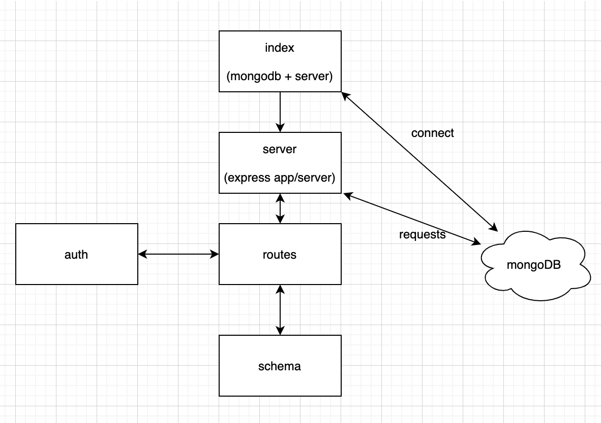

# LAB - Class 04

## Project: Basic Auth

### Author: Mariko Alvarado

### Links and Resources
-  Simon, Garrett, Kristian, Nathan, Ricardo

- [front-end application](https://mariko-basic-auth.herokuapp.com/signup)

(can't deploy^^^)

### Setup

#### `.env` requirements (where applicable)

- `PORT` - 3000
- `MONGODB_URI` - mongodb://localhost:27017/auth

#### How to initialize/run your application (where applicable)

Plug in front end url localhost:3000/signup or /signin into postman and perform different requests.

#### Tests

1. install `@code-fellows/supergoose`
2. run `npm test` 

#### UML

